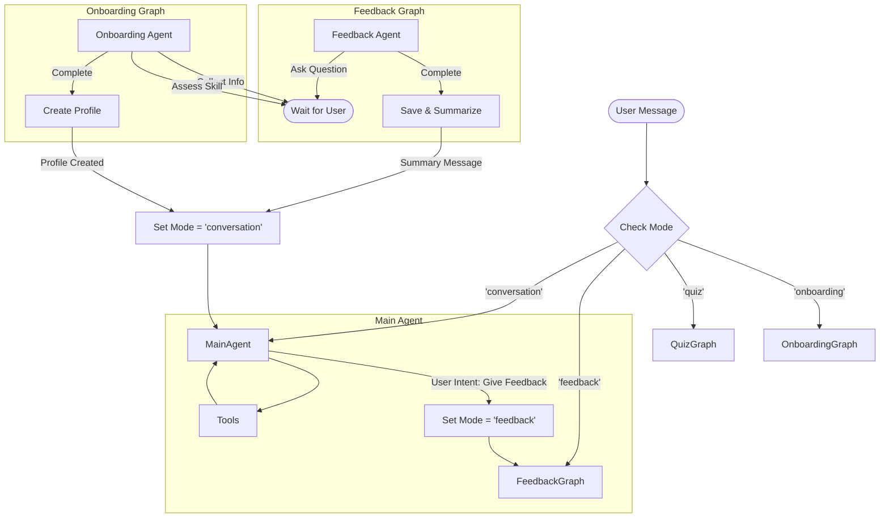

# Proposal: Scoped Conversation Subgraphs for Feedback & Activities

## 1. Problem Definition
Currently, `LanguageBuddyAgent` operates as a single, linear conversation stream. This presents challenges for "inner loop" activities like Feedback collection, Quizzes, or targeted Grammar Practice:
- **Context Pollution**: Multi-turn interactions (e.g., 5 questions for a quiz) clog the main conversation history with ephemeral content.
- **Context Confusion**: The AI might confuse the "Quiz Master" persona with the "Language Buddy" persona if history is mixed.
- **Token Efficiency**: Storing every "Next question..." and "My answer is..." permanently is wasteful.

## 2. Proposed Architecture: The Router-Subgraph Pattern

We will transition `LanguageBuddyAgent` from a simple `createReactAgent` to a custom `StateGraph` that orchestrates multiple **Subgraphs**.

### 2.1. The "Inner Loop" Concept
An "Inner Loop" (like Feedback) is a self-contained conversation that:
1.  **Inherits Context**: Knows who the user is and what they just said.
2.  **Isolates State**: Maintains its own temporary message history (`scratchpad`).
3.  **Produces a Result**: Ends with a concrete outcome (e.g., `FeedbackEntry` saved, or "Score: 5/5").
4.  **Collapses History**: Upon completion, the detailed turns are discarded. Only a **Summary** is injected back into the Main Conversation.

### 2.2. State Schema
We will expand the agent's state to support modes and scoped history.

```typescript
interface AgentState {
  // The persistent, long-term conversation history
  messages: BaseMessage[]; 
  
  // The Subscriber profile
  subscriber: Subscriber;
  
  // Tracks which "mode" or subgraph is currently active
  activeMode: 'conversation' | 'feedback' | 'quiz' | 'onboarding';
  
  // Ephemeral storage for the active subgraph. 
  // Cleared when the subgraph exits.
  subgraphState?: {
    messages: BaseMessage[]; // The "inner" history
    context: Record<string, any>; // Specific data (e.g., quiz score, feedback stage)
  };
}
```

### 2.3. The Graph Structure



### 2.4. Mechanism: The "Collapse"
When `FeedbackGraph` finishes:
1.  It constructs a **Summary Message**: *"User completed a feedback session. Rating: 5/5. Comment: 'Great job!'."*
2.  It appends this Summary Message to the parent `messages` array.
3.  It **discards** the `subgraphState.messages`.
4.  It resets `activeMode` to `'conversation'`.

This ensures the Main Agent "remembers" that feedback happened, but isn't distracted by the specific "What is your rating?" ... "5" ... "Why?" ... questions.

## 3. Implementation Plan

### Phase 1: Feature Refactor (Feedback)
Create a standalone Graph for the Feedback feature.
- **File**: `src/features/feedback/feedback.graph.ts`
- **Definition**: A `StateGraph` that manages the feedback interview flow (Sentiment check -> Rating -> Details -> Categorization).
- **Output**: Returns a `FeedbackSummary`.

### Phase 2: Onboarding Refactor (New)
Migrate the implicit onboarding logic into a dedicated Graph.
- **File**: `src/features/onboarding/onboarding.graph.ts`
- **Definition**: A `StateGraph` that:
    1.  **Profile Collection**: Iteratively collects Name, Timezone, Languages.
    2.  **Skill Assessment**: Ramps up conversation difficulty until failure/ceiling is detected.
    3.  **Finalization**: Creates the `Subscriber` record in the database.
- **Trigger**: The Router checks if the `subscriber` record exists. If not, it routes to `OnboardingGraph`.
- **Output**: A new Subscriber profile and an initial difficulty level.

### Phase 3: Core Agent Refactor
Refactor `LanguageBuddyAgent` to use `StateGraph` instead of `createReactAgent`.
- **Node**: `main_conversation` (The existing ReAct agent logic).
- **Node**: `feedback_subgraph` (Invokes the graph from Phase 1).
- **Node**: `onboarding_subgraph` (Invokes the graph from Phase 2).
- **Router**: Logic in `processUserMessage` (or a dedicated Router node) to direct traffic based on `state.activeMode` or Subscriber existence.

### Phase 4: Tooling
- Update `tools` to include state-transition capabilities (e.g., `startFeedbackSession` tool that sets `state.activeMode = 'feedback'`).

## 4. Example Flow

### Feedback Flow
1.  **User**: "I want to complain."
2.  **Main Agent**: Calls `startFeedbackSession()`. State becomes `mode='feedback'`.
3.  **Router**: Directs next turn to `FeedbackGraph`.
4.  **Feedback Agent**: "I'm sorry to hear that. What went wrong?" (stored in `subgraphState`).
5.  **User**: "The bot is too slow." (stored in `subgraphState`).
6.  **Feedback Agent**: Saves feedback. Returns summary: "User reported latency issues."
7.  **System**:
    - `subgraphState` wiped.
    - `messages`: [..., User: "I want to complain.", System: "User reported latency issues."]
8.  **Main Agent**: "Thank you for letting us know. We'll look into the speed issues."

### Onboarding Flow
1.  **New User**: "Hello!"
2.  **Router**: No Subscriber found. Routes to `OnboardingGraph`.
3.  **Onboarding Agent**: "Hi! I'm LanguageBuddy. What's your name?"
4.  **User**: "Max."
5.  **Onboarding Agent**: "Nice to meet you, Max! What language do you want to learn?"
... (Assessment ensues) ...
6.  **Onboarding Agent**: Determines C1 level. Creates Subscriber.
7.  **System**:
    - `subgraphState` wiped.
    - `messages`: [System: "User Max onboarded. Level: C1. Languages: German -> English."]
8.  **Main Agent**: "Great Max, let's start practicing English at a C1 level!"

This approach provides the **Structure** of a rigid process (Feedback) with the **Flexibility** of the LLM, without polluting the long-term context.
