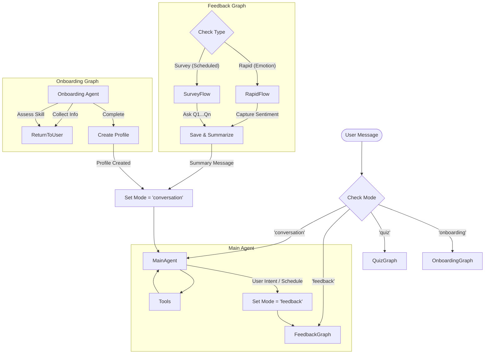

# Proposal: Scoped Conversation Subgraphs for Feedback & Activities

## 1. Problem Definition
Currently, `LanguageBuddyAgent` operates as a single, linear conversation stream. This presents challenges for "inner loop" activities like Feedback collection, Quizzes, or targeted Grammar Practice:
- **Context Pollution**: Multi-turn interactions (e.g., 5 questions for a quiz) clog the main conversation history with ephemeral content.
- **Context Confusion**: The AI might confuse the "Quiz Master" persona with the "Language Buddy" persona if history is mixed.
- **Token Efficiency**: Storing every "Next question..." and "My answer is..." permanently is wasteful.

## 2. Proposed Architecture: The Router-Subgraph Pattern

We will transition `LanguageBuddyAgent` from a simple `createReactAgent` to a custom `StateGraph` that orchestrates multiple **Subgraphs**.

### 2.1. The "Inner Loop" Concept
An "Inner Loop" (like Feedback) is a self-contained conversation that:
1.  **Inherits Context**: Knows who the user is and what they just said.
2.  **Isolates State**: Maintains its own temporary message history (`scratchpad`).
3.  **Produces a Result**: Ends with a concrete outcome (e.g., `FeedbackEntry` saved, or "Score: 5/5").
4.  **Collapses History**: Upon completion, the detailed turns are discarded. Only a **Summary** is injected back into the Main Conversation.

### 2.2. State Schema
We will expand the agent's state to support modes and scoped history.

```typescript
interface AgentState {
  // The persistent, long-term conversation history
  messages: BaseMessage[]; 
  
  // The Subscriber profile
  subscriber: Subscriber;
  
  // Tracks which "mode" or subgraph is currently active
  activeMode: 'conversation' | 'feedback' | 'quiz' | 'onboarding';
  
  // Ephemeral storage for the active subgraph. 
  // Cleared when the subgraph exits.
  subgraphState?: {
    messages: BaseMessage[]; // The "inner" history
    context: Record<string, any>; // Specific data (e.g., quiz score, feedback stage)
  };
}
```

### 2.3. The Graph Structure



### 2.4. Mechanism: The "Collapse"
(Same as before: Subgraph history is discarded, only summary remains.)

## 3. Expanded Features

### 3.1. Feedback Variants
The `FeedbackGraph` will support an input configuration to determine its behavior:
1.  **Rapid Feedback (Emotion-Triggered)**:
    -   **Trigger**: User expresses strong emotion (Euphoria/Frustration). Detected by Main Agent logic/Sentiment analysis.
    -   **Flow**: Single-turn or 2-turn interaction. "I see you're frustrated. What happened?" -> Save -> Resume.
2.  **Structured Survey (Scheduled)**:
    -   **Trigger**: Bi-weekly/Monthly schedule (checked by `SchedulerService`).
    -   **Flow**: Iterates through a configured list of questions (e.g., "Voice vs. Images?").
    -   **Config**: Admin can define the question set for that specific period.

### 3.2. Special Events (The "Viking" Scenario)
To support "Special Weekends" where the persona changes (e.g., Maya -> Viking), we will introduce an **Event Context Layer** to the Main Agent.

-   **`EventService`**: Checks if the current date matches a configured "Special Event".
-   **System Prompt Injection**:
    -   Standard: "You are Maya, a helpful tutor..."
    -   Event Override: "It is Viking Weekend! You are Ragnar. You scream battle cries between grammar explanations."
-   **Implementation**: 
    -   This is primarily handled in the `MainAgent` node's `generateSystemPrompt` logic.
    -   It does *not* require a separate Subgraph unless the *interaction mechanics* change fundamentally (e.g., a Choose-Your-Own-Adventure game). For persona swaps, prompt injection is sufficient.

## 4. Implementation Plan

### Phase 1: Feature Refactor (Feedback)
Create a standalone Graph for the Feedback feature.
- **File**: `src/features/feedback/feedback.graph.ts`
- **Definition**: A `StateGraph` that manages the feedback interview flow.
- **Internal Logic**: Logic to branch between `Rapid` and `Survey` flows based on initialization arguments.
- **Output**: Returns a `FeedbackSummary`.

### Phase 2: Onboarding Refactor
Migrate the implicit onboarding logic into a dedicated Graph.
- **File**: `src/features/onboarding/onboarding.graph.ts`
... (Rest of Onboarding Plan) ...

### Phase 3: Core Agent Refactor
... (Rest of Core Agent Plan) ...

### Phase 4: Event System
- **File**: `src/features/events/event.service.ts`
- **Logic**: Define start/end times and System Prompt overrides for events.
- **Integration**: Update `LanguageBuddyAgent.generateSystemPrompt` to pull from `EventService`.

### Phase 5: Tooling & Scheduling
- **Tools**: `startFeedbackSession(type: 'rapid' | 'survey')`.
- **Scheduler**: Logic to trigger `startFeedbackSession('survey')` on specific weeks.

## 5. Example Flow

### Structured Survey Flow
1.  **System (Scheduler)**: Detects "Feedback Tuesday". Inject "Please start a feedback survey" into Main Agent instructions.
2.  **Main Agent**: "Hi Max! It's that time of the month. Do you have a minute to help us improve?"
3.  **User**: "Sure."
4.  **Main Agent**: Calls `startFeedbackSession(type='survey')`.
5.  **Router**: Routes to `FeedbackGraph`.
6.  **Feedback Agent**: "Great! Question 1: Would you prefer Voice Messages or Image Reading next?"
7.  **User**: "Voice messages."
8.  **Feedback Agent**: "Noted. Question 2: ..."
...
9.  **Feedback Agent**: Saves all answers. Returns summary.
10. **Main Agent**: "Thanks for the input! Now back to German..."

### Viking Weekend Flow
1.  **User**: "Hello."
2.  **Main Agent**: Checks `EventService`. Finds `Event: VikingWeekend`.
3.  **Main Agent**: Generates Prompt with Viking Persona.
4.  **Main Agent**: "SKÅL! I AM RAGNAR! Today we conquer the Dative case! ARE YOU READY?"

This approach provides the **Structure** of a rigid process (Feedback) with the **Flexibility** of the LLM, without polluting the long-term context.
