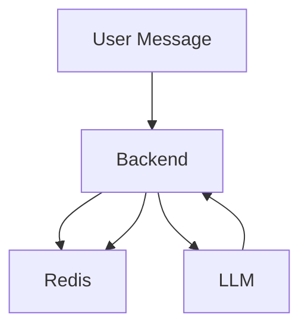

# System Interaction: Redis Usage

- **Subscribers**: Redis stores subscriber data (e.g., WhatsApp numbers, subscription status).
- **Conversation States**: Redis keeps track of ongoing conversations, storing context and state for each user.

## Example Flow
1. User sends a message.
2. Backend checks Redis for the user's conversation state.
3. If new, initializes state; if existing, loads context.
4. After LLM response, updates state in Redis.
5. Subscriber data is read/written as needed for subscription management.

## Redis Keys (examples)
- `subscriber:{phone}`: Stores subscriber info
- `checkpoint:{user_id}`: Stores conversation state/context

## Diagram

