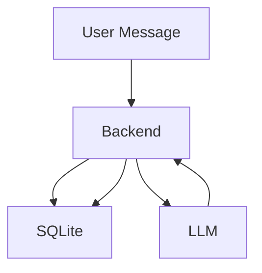

# System Interaction: SQLite Usage

- **Subscribers**: SQLite stores subscriber data (e.g., WhatsApp numbers, subscription status).
- **Conversation States**: SQLite keeps track of ongoing conversations, storing context and state for each user.

## Example Flow
1. User sends a message.
2. Backend checks SQLite for the user's conversation state.
3. If new, initializes state; if existing, loads context.
4. After LLM response, updates state in SQLite.
5. Subscriber data is read/written as needed for subscription management.

## Database Tables (examples)
- `subscribers`: Stores subscriber info (primary key: `phone_number`)
- `checkpoints`: Stores conversation state/context (primary key: `thread_id`)

## Diagram

