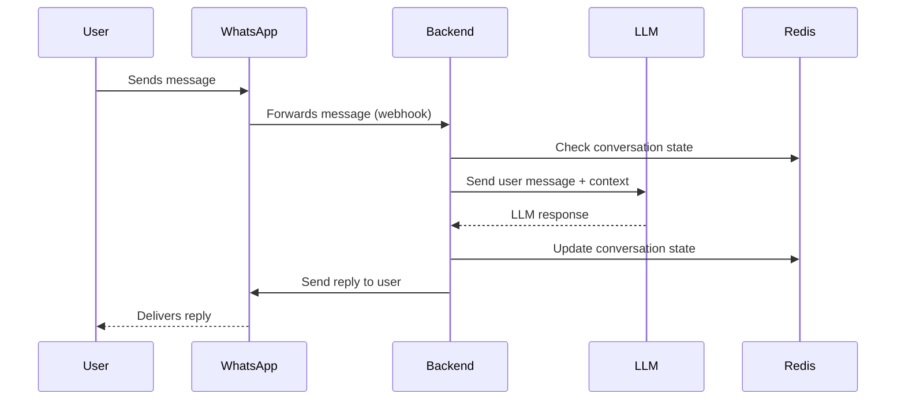

# User Interactions Flow

```mermaid
sequenceDiagram
    participant User
    participant WhatsApp
    participant Backend
    participant LLM
    participant Redis

    User->>WhatsApp: Sends message
    WhatsApp->>Backend: Forwards message (webhook)
    Backend->>Redis: Check conversation state
    Backend->>LLM: Send user message + context
    LLM-->>Backend: LLM response
    Backend->>Redis: Update conversation state
    Backend->>WhatsApp: Send reply to user
    WhatsApp-->>User: Delivers reply
```

This diagram shows the flow of user interactions from message sending to LLM response and state management.
